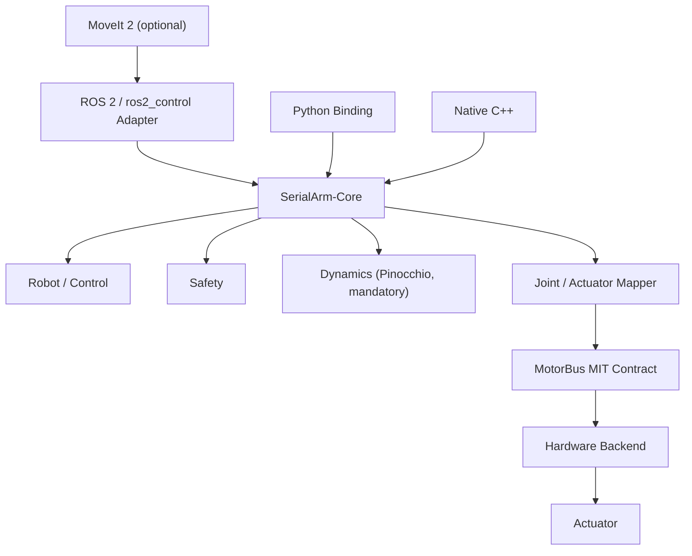

<div align="center">

# SerialArm-Core

Portable C++17 control, dynamics, safety and hardware abstraction core for custom serial manipulators

面向自研串联机械臂的 C++17 控制、动力学、安全与硬件抽象核心

[](https://github.com/Kaede-Rei/SerialArm-Core)
[](https://isocpp.org/)
[](https://docs.ros.org/en/humble/)
[](https://moveit.picknik.ai/)

</div>

## 项目简介

面向自研串联机械臂的通用控制核心与硬件适配框架，集成关节阻抗控制、Pinocchio 动力学前馈、Hardware Backend、ros2_control 与 Robot Profile；Core 使用 C++17，面向 N-DOF serial arm；DM-Arm 是当前 reference robot support，Damiao 是当前 reference hardware backend

项目边界是：

- Robot Model
- Dynamics
- Control
- Safety
- Joint / Actuator Mapping
- Hardware Backend
- Framework Adapter

ROS 2 / ros2_control 是 Adapter；MoveIt 2 是 ROS 2 上层可选能力；Dynamics 是 Core 强制组成部分，始终依赖 Pinocchio；Hardware Backend 必须实现完整 MIT / impedance actuator semantics：`position`、`velocity`、`torque`、`kp`、`kd`

## 核心设计



关键约束：

- MoveIt optional：`display.launch.py`、`hardware.launch.py`、ros2_control `SystemInterface` 和基础 Robot Profile 加载不依赖 MoveIt 配置；只有 `moveit.launch.py` 要求 profile 定义 MoveIt support
- Dynamics mandatory：不维护 No-Dynamics 分支；没有真实惯性参数时使用合法 placeholder inertial，后续用 CAD 或实测参数替换
- MIT Backend mandatory：Core 不根据 Backend 能力降级；如果硬件协议不原生支持 MIT，由 Backend 自己完成映射、模拟或适配

## 当前能力

| 能力 | 状态 |
| --- | --- |
| C++17 Core | 已实现 |
| N-DOF serial arm | 已实现并有 4DOF fixture 测试 |
| Pinocchio Dynamics | 必选，已实现 |
| Safety | 已实现，含 continuous joint 位置限位跳过 |
| Joint / Actuator Mapping | 已实现 |
| Five impedance modes | `RIGID_HOLD`、`RIGID_TRACKING`、`COMPLIANT_HOLD`、`COMPLIANT_DRAG`、`COMPLIANT_TRACKING` |
| Damiao Backend | Reference backend |
| Python Binding | 已实现 |
| ros2_control | Adapter 已实现 |
| MoveIt 2 | Optional launch support |
| LeRobot | Planned |
| Isaac / Isaac Lab | Planned |

## 仓库结构

```text
src/
├── serial_arm/
│   ├── core/                 # C++ Core、Dynamics、Safety、ModelLoader、Python Binding
│   └── bringup/ros2_control/ # ROS 2 / ros2_control Adapter 和 launch
└── robot_supports/
    ├── hardware/             # Hardware Backend，例如 Damiao
    ├── robots/               # Robot Support，例如 DM-Arm
    └── profiles/             # Robot Profile 聚合配置
```

项目文档只维护三份：

- [README.md](README.md)：项目首页和接入概览
- [Tutorial.md](Tutorial.md)：完整教程、配置、bringup、调参、troubleshooting
- [API.md](API.md)：C++ / Python / MotorBus API Reference

## Quick Start

### 纯 C++ Core

```bash
cmake -S src/serial_arm/core -B build/serial_arm_core \
  -DSERIAL_ARM_BUILD_PYTHON=OFF \
  -DSERIAL_ARM_BUILD_TERMINAL=OFF
cmake --build build/serial_arm_core
cmake --install build/serial_arm_core --prefix install/serial_arm_core
```

下游 CMake 项目可以直接导入：

```cmake
find_package(serial_arm_core CONFIG REQUIRED)

add_executable(my_arm_driver main.cpp)
target_link_libraries(my_arm_driver
  PRIVATE
    serial_arm::core
    serial_arm::config
    serial_arm::robot
    serial_arm::dynamics
)
```

### 纯 C++ 终端工具

如果只想在本仓库里用终端联调 Core、Dynamics 和 Hardware Backend：

```bash
cmake -S src/serial_arm/core -B build/serial_arm_core \
  -DSERIAL_ARM_BUILD_PYTHON=OFF \
  -DSERIAL_ARM_BUILD_TERMINAL=ON
cmake --build build/serial_arm_core --target serial_arm_terminal
```

构建后可运行 `serial_arm_terminal`：

```bash
./build/serial_arm_core/serial_arm_terminal \
  --config install/dm_arm_description/share/dm_arm_description/config/core/gray.yaml \
  --hardware-plugin serial_arm_hardware_damiao \
  --hardware-config install/dm_arm_description/share/dm_arm_description/config/hardware.yaml
```

当用 ament/colcon 的 package-share 目录体系进行编译时，可以使用 robog-profile 来指定；以 `dm_arm_gray` 为例，先 source workspace，让终端能从 `serial_arm_robot_profiles` 找到 profile，并让 `HardwareLoader` 找到 Damiao Backend：

```bash
source install/setup.bash
./build/serial_arm_core/serial_arm_terminal --robot-profile dm_arm_gray
```

### Python

Python Binding 可以作为脚本或上层应用的控制入口，也提供 Python terminal；构建 wheel 后安装：

```bash
cd src/serial_arm/core/python
python -m build --wheel
python -m pip install --force-reinstall dist/serial_arm-*.whl
```

以 `dm_arm_gray` 做无真机检查：

```bash
source install/setup.bash
python ../app/serial_arm_terminal.py --robot-profile dm_arm_gray --check-only
```

启动 Python terminal：

```bash
source install/setup.bash
python ../app/serial_arm_terminal.py --robot-profile dm_arm_gray
```

### ROS 2 / ros2_control

以当前 DM-Arm profile 为入口：

```bash
colcon build --symlink-install
source install/setup.bash
```

只查看模型：

```bash
ros2 launch serial_arm_ros2_control display.launch.py robot_profile:=dm_arm_gray
```

启动 ros2_control：

```bash
ros2 launch serial_arm_ros2_control hardware.launch.py robot_profile:=dm_arm_gray
```

启动 MoveIt 2：

```bash
ros2 launch serial_arm_ros2_control moveit.launch.py robot_profile:=dm_arm_gray
```

如果某个 Robot Profile 没有 `moveit` 字段，`display.launch.py` 和 `hardware.launch.py` 仍应工作；只有 `moveit.launch.py` 会报出明确错误

## 添加新机械臂

### Case A：新机械臂 + 已有 Hardware Backend

例如 “New Pieper Arm + Damiao”：不改 Core，不写新 Backend，只新增 robot support、配置和 profile

推荐目录：

```text
src/robot_supports/robots/<robot_name>/
├── description/
│   ├── model/
│   └── config/
│       ├── core/<variant>.yaml
│       ├── hardware.yaml
│       └── ros2_controllers.yaml
└── moveit_config/            # 可选
```

最小 profile 可以没有 MoveIt：

```yaml
profiles:
  my_arm:
    core:
      package: my_arm_description
      config: config/core/default.yaml
    hardware:
      plugin: serial_arm_hardware_damiao
      config_package: my_arm_description
      config: config/hardware.yaml
    description:
      package: my_arm_description
      urdf: model/my_arm.urdf
      ros2_control_xacro: model/my_arm.ros2_control.xacro
    controllers:
      package: my_arm_description
      config: config/ros2_controllers.yaml
```

核心接入顺序：

1. 准备 URDF/Xacro、mesh、joint order、transmission 或 ros2_control xacro
2. 写 `core` config：runtime、controller gains、mapping、safety、dynamics
3. 写 hardware instance config：actuator id、型号、串口或 CAN 配置
4. 在 `robot_profiles.yaml` 注册 profile
5. 先跑 display，再跑 fake/mock，再跑真机

完整流程见 [Tutorial.md](Tutorial.md)

## 添加新 Hardware Backend

当新机器人使用新的执行器协议时，在 `src/robot_supports/hardware/<backend_name>/` 新增 Backend，并实现 `serial_arm::MotorBus`

Backend 协议不是 capability negotiation；每个完整支持的 Backend 都必须接收并执行 Core 下发的完整 MIT semantics：

- `position`
- `velocity`
- `torque / effort`
- `kp`
- `kd`

如果底层硬件不原生支持 MIT，则协议映射、闭环模拟、单位换算和限制处理都属于 Backend 内部职责；Core、Robot 和 Controller 不为“不支持 MIT”的硬件增加降级分支

## 许可证

以仓库当前 LICENSE 为准
