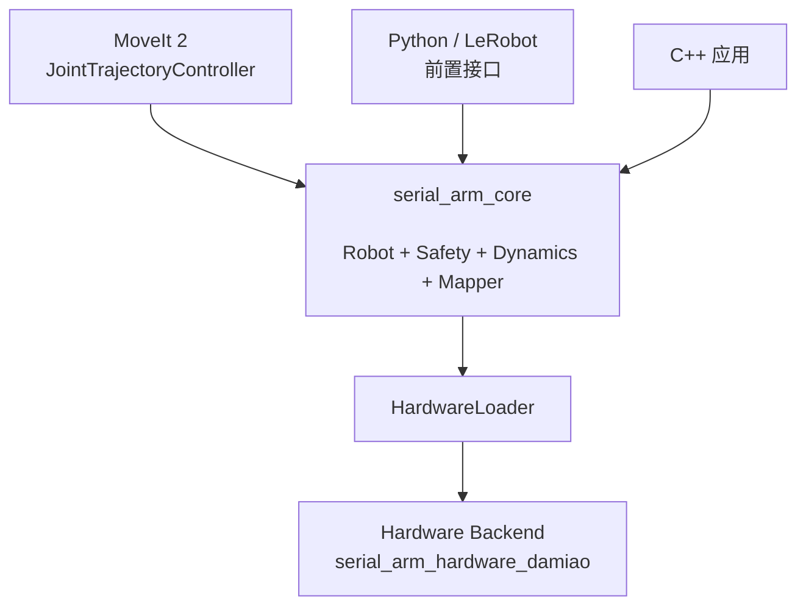
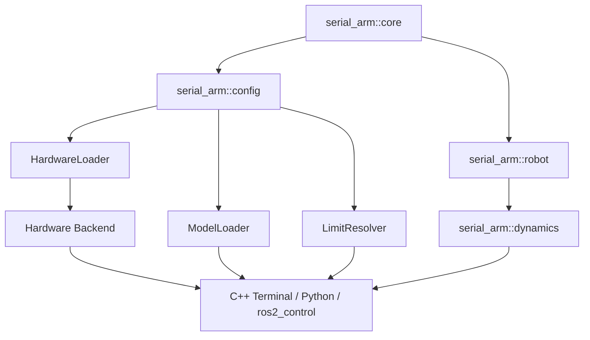

<div align="center">

# SerialArm-Core

面向自研串联机械臂的可移植 C++17 控制、动力学与硬件抽象核心；当前以 DM-Arm 和 Damiao Backend 作为首个真机参考实现

[](https://github.com/Kaede-Rei/SerialArm-Core/blob/main/LICENSE)
[](https://docs.ros.org/en/humble/)
[](https://control.ros.org/humble/doc/ros2_control/doc/index.html)
[](https://moveit.picknik.ai/humble/)
[](https://stack-of-tasks.github.io/pinocchio/)


</div>

---

## 1. 项目定位

### 1.1. 项目目标

SerialArm-Core 将机械臂的控制闭环、硬件通信和上层框架适配分离；核心库不依赖 ROS 2，上层可通过 C++、Python 或 ros2_control 使用同一套 Robot、Safety、Joint/Actuator 映射和动力学逻辑



### 1.2. 核心能力

- 五种 Joint 阻抗模式
- 位置、位置速度、位置速度力矩三类参考命令
- Joint 与 Actuator 双向映射
- URDF Joint 限位读取与 Hardware Backend Capability 合并
- Safety Policy 与最终限制解析
- Robot 生命周期、FAULT 锁存和故障刚性保持
- 通用 `MotorBus` 合同与动态 Hardware Backend 加载
- `serial_arm_hardware_damiao` 达妙串口后端
- Pinocchio FK、Jacobian、质量矩阵、RNEA 和 ABA
- 重力、非线性、科氏离心和完整逆动力学前馈
- C++ 真机终端和模型查看器
- pybind11 离线 API 与 C++ Worker 真机会话
- ros2_control `SystemInterface`
- 有夹爪和无夹爪 MoveIt 2 配置

### 1.3. 适用场景

- DM-Arm 单臂控制和动力学验证
- 达妙关节电机机械臂快速接入
- C++ 机器人控制应用
- Python 数据采集、算法验证和机器人学习接口开发
- ROS 2 `controller_manager`、JointTrajectoryController 和 MoveIt 2 接入
- 后续替换电机后端或机械臂 URDF 的平台化开发

### 1.4. 新增串联机械臂

新增另一台串联机械臂时，原则上只在 `src/robot_supports/` 下新增机器人 description/config、MoveIt Config、Robot Profile 和必要的 Hardware Backend；`src/serial_arm/` 是稳定通用框架区域，通常不需要修改

### 1.5. 目录边界

```text
src/
├── serial_arm/
│   ├── core/
│   └── bringup/
│       ├── ros2_control/
│       ├── lerobot/
│       └── isaac_sim/
└── robot_supports/
    ├── hardware/
    ├── profiles/
    └── robots/
```

`serial_arm/` 表示 Stable Framework，保存 Core、ros2_control 通用适配和预留的 LeRobot / Isaac Sim 适配目录；新增机器人、模型变体和后端时原则上不修改这里

`robot_supports/` 表示 Extension Area，保存具体机器人、Hardware Backend、Robot Profile、Description、Robot-specific YAML 和 MoveIt Config；DM-Arm 是当前 reference robot；Damiao 是当前第一套 Hardware Backend

## 2. 当前实现

### 2.1. serial_arm_core

`src/serial_arm/core` 是独立 C++17 核心包；包括 Config、ModelLoader、Hardware Capability、HardwareLoader、LimitResolver、JointCtrller、JointActuatorMapper、Safety、Robot 和 Dynamics；Core 不包含具体电机协议或厂商后端

Core 对外导出

```text
serial_arm::core
serial_arm::config
serial_arm::robot
serial_arm::dynamics
```

### 2.2. serial_arm_hardware_damiao

`src/robot_supports/hardware/damiao` 是当前真机参考 Hardware Backend；它实现 Core 的 `MotorBus` 合同，读取 `dm_arm_damiao.yaml`，并以共享库形式导出 `create_motor_bus` / `destroy_motor_bus`

### 2.3. Python Binding

`src/serial_arm/core/python` 使用 pybind11 和 scikit-build-core 构建 wheel；提供 Config、JointCtrller、JointActuatorMapper、Safety、Dynamics 和 `RobotSession`

`RobotSession` 使用 C++ Worker 按 `runtime.ctrl_frequency_hz` 调用 `Robot::cycle()`；Python 线程只提交模式、目标和调参请求，并读取状态快照

### 2.4. serial_arm_ros2_control

`src/serial_arm/bringup/ros2_control` 是独立 `ament_cmake` 包；实现 `hardware_interface::SystemInterface`，按 Robot Description/Core Config 中的受控关节导出 position、velocity 命令接口和 position、velocity、effort 状态接口

SystemInterface 内部 Worker 独占 Robot、Dynamics 和 Hardware Backend；`read()` 与 `write()` 只交换缓存

### 2.5. MoveIt 2

仓库包含两套 MoveIt 2 配置

```text
src/robot_supports/robots/dm_arm/moveit_config/dm_arm_no_gripper
src/robot_supports/robots/dm_arm/moveit_config/dm_arm_with_gripper
```

两套配置均包含 SRDF、KDL、关节限制、OMPL、RViz 和控制器映射；Setup Assistant 生成的 demo 默认使用 Mock/FakeSystem，接入真机前需要确保 MoveIt 控制器名称与 ros2_control 中实际激活的控制器一致

## 3. 安全说明

### 3.1. 真机风险

> [!WARNING]
> 本项目能够通过 Hardware Backend 向真实机械臂发送执行器命令；错误的后端配置、零位、方向、比例、限位、增益、质量属性、重力方向或执行器型号可能导致突然运动、碰撞、过流、坠落或机构损坏

本项目不能替代工业安全控制器、机械硬限位、制动器、急停回路和正式风险评估

### 3.2. 启动前检查

1. 准备独立急停和可靠机械支撑
2. 确认串口设备、六个 motor ID、master ID 和电机型号
3. 逐轴确认位置、速度和力矩反馈方向
4. 标定 `direction`、`pos_ratio`、`tor_ratio` 和零位偏移
5. 核对 URDF 位置、速度、effort 限位与真实机械范围
6. 核对 `SafetyPolicyCfg`、控制增益和停放姿态
7. 从低速度、低补偿比例和无碰撞姿态开始
8. 未完成检查时保持 `runtime.write_enabled: false`

### 3.3. FAULT 与失能处理

- 可恢复 Safety 或读取故障可能进入 FAULT 刚性保持
- FAULT 保持期间必须继续刷新 `maintain_fault_hold()`
- 写入失败、执行器失能或保持刷新失败可能降级为失能
- `force_deactivate()` 和 Python `stop()` 不等价于回到停放姿态
- 通信中断时软件不能保证持续保持，应先使用机械支撑和急停

## 4. 快速开始

最小离线启动流程：

```bash
source /opt/ros/humble/setup.bash
colcon build --symlink-install \
  --packages-select serial_arm_core serial_arm_hardware_damiao serial_arm_robot_profiles dm_arm_description serial_arm_ros2_control dm_arm_no_gripper dm_arm_with_gripper
source install/setup.bash
ros2 launch serial_arm_ros2_control display.launch.py robot_profile:=dm_arm_gray
```

`robot_profile` 必须显式传入；`dm_arm_gray` / `dm_arm_white` 到 Core YAML、URDF 变体和 MoveIt 包的映射统一写在 `src/robot_supports/profiles/config/robot_profiles.yaml`

### 4.1. 构建

```bash
source /opt/ros/humble/setup.bash
colcon build --symlink-install \
  --packages-select serial_arm_core serial_arm_hardware_damiao serial_arm_robot_profiles dm_arm_description serial_arm_ros2_control dm_arm_no_gripper dm_arm_with_gripper
source install/setup.bash
```

### 4.2. 离线显示模型

```bash
ros2 launch serial_arm_ros2_control display.launch.py robot_profile:=dm_arm_gray
```

`display.launch.py` 只用于查看模型和拖动关节

可选 profile：

```text
dm_arm_gray   无夹爪
dm_arm_white  有夹爪
```

### 4.3. 启动 Terminal

Terminal 使用同一份 Core YAML；是否连接真机只由 `runtime.write_enabled` 决定

```bash
./install/serial_arm_core/bin/serial_arm_terminal \
  --hardware-plugin serial_arm_hardware_damiao \
  --hardware-config src/robot_supports/robots/dm_arm/description/config/hardware.yaml \
  --config src/robot_supports/robots/dm_arm/description/config/gray.yaml
```

Python Terminal：

```bash
python src/serial_arm/core/app/serial_arm_terminal.py \
  --hardware-plugin serial_arm_hardware_damiao \
  --hardware-config src/robot_supports/robots/dm_arm/description/config/hardware.yaml \
  --config src/robot_supports/robots/dm_arm/description/config/gray.yaml
```

Python 配置检查不连接真机：

```bash
python src/serial_arm/core/app/serial_arm_terminal.py \
  --hardware-plugin serial_arm_hardware_damiao \
  --hardware-config src/robot_supports/robots/dm_arm/description/config/hardware.yaml \
  --config src/robot_supports/robots/dm_arm/description/config/gray.yaml \
  --check-only
```

### 4.4. 启动 ros2_control

先确认对应配置中的真机写入开关：

```yaml
runtime:
  write_enabled: false
  tracking_impedance_mode: RIGID_TRACKING
```

`false` 使用离线 mock 后端，不连接串口、不使能电机、不写真实硬件；确认机械臂、急停、零位、方向、限位和电机型号后，再改为 `true` 使用 Damiao 真机后端

`tracking_impedance_mode` 可选 `RIGID_TRACKING` 或 `COMPLIANT_TRACKING`；MoveIt/JTC 轨迹仍走同一个 `joint_trajectory_controller`

```bash
ros2 launch serial_arm_ros2_control hardware.launch.py robot_profile:=dm_arm_gray
```

检查状态：

```bash
ros2 control list_hardware_components
ros2 control list_controllers
ros2 topic echo /joint_states
```

`src/robot_supports/robots/dm_arm/description/config/ros2_controllers.yaml` 是 controller_manager 和 JTC 的统一配置，通常不需要改；只有在关节名称/顺序、控制器名称、接口类型、update_rate、FollowJointTrajectory action 映射或 JTC 行为参数确实变化时才修改

### 4.5. 启动 MoveIt

```bash
ros2 launch serial_arm_ros2_control moveit.launch.py robot_profile:=dm_arm_gray
```

## 5. 总体架构

### 5.1. 仓库包关系

```text
DM-Arm workspace
├── src/serial_arm/core
│   ├── 独立 C++ Core
│   ├── Python Binding
│   └── C++/Python Terminal
├── src/serial_arm/bringup/ros2_control
│   └── ros2_control SystemInterface 和通用 Launch
├── src/robot_supports/profiles
│   └── Robot Profile
├── src/robot_supports/hardware/damiao
│   └── Damiao Hardware Backend
├── src/robot_supports/robots/dm_arm/description
│   ├── config
│   └── model
└── src/robot_supports/robots/dm_arm/moveit_config
    ├── dm_arm_no_gripper
    └── dm_arm_with_gripper
```

依赖方向

```text
MoveIt 2 Config
       ↓
serial_arm_ros2_control
       ↓
   serial_arm_core
```

Core 根 CMake 不包含 ROS 2 构建选项；ROS 2 适配由独立包和 colcon 的包选择决定

### 5.2. Core 模块关系



模块边界

- `JointCtrller` 只处理 Joint 侧阻抗和参考命令
- `JointActuatorMapper` 只处理方向、比例和零位映射
- `Safety` 只检查状态与命令，并返回对应动作
- `Dynamics` 只计算并缓存运动学与动力学结果
- `Hardware Backend` 只处理通信、协议和 Actuator 侧能力
- `Robot` 统一组织生命周期和单周期闭环

### 4.3. Robot 单周期闭环

```text
MotorBus::read()
        ↓
JointActuatorMapper::to_joint_state()
        ↓
Safety::check_state()
        ↓
关节加速度估计
        ↓
JointCtrller 生成初始命令
        ↓
参考加速度估计
        ↓
Dynamics::update()
        ↓
模型前馈
        ↓
JointCtrller::update()
        ↓
Safety::check_joint_cmd()
        ↓
JointActuatorMapper::to_actuator_cmd()
        ↓
MotorBus::write()
```

### 4.4. 控制循环调度边界

`Robot::cycle()` 是单周期接口；Core 不固定创建 200 Hz 线程

#### 4.4.1. C++ Terminal

`serial_arm_terminal` 创建 Worker，并按 `cfg.runtime.ctrl_frequency_hz` 调用 `Robot::cycle()`

#### 4.4.2. Python RobotSession

`RobotSession` 的 C++ Worker 维护实时周期；Python 主线程不直接操作串口

#### 4.4.3. ros2_control

`SerialArmSystem` Worker 独占 Robot 和硬件；controller_manager 的 `read()`、`write()` 只复制 StateFrame 和 CommandFrame

## 5. 仓库结构

### 5.1. serial_arm_core

```text
src/serial_arm/core
├── app
│   ├── serial_arm_terminal.cpp
│   ├── serial_arm_terminal.py
│   └── serial_arm_model_viewer.py
├── include/serial_arm
├── python
├── src
├── third_lib
├── API.md
├── CMakeLists.txt
└── package.xml
```

### 5.2. dm_arm_description

```text
src/robot_supports/robots/dm_arm/description
├── robots
│   └── dm_arm
│       ├── meshes
│       └── urdf
│           ├── dm_arm.urdf
│           ├── dm_arm_no_gripper.urdf
│           └── dm_arm.ros2_control.xacro
├── CMakeLists.txt
└── package.xml
```

### 5.3. serial_arm_ros2_control

```text
src/serial_arm/bringup/ros2_control
├── config
│   ├── dm_arm_gray.yaml
│   ├── dm_arm_white.yaml
│   └── ros2_controllers.yaml
```

`description/config/` 保存 Robot-specific YAML，包括 Core YAML、Hardware instance YAML、ros2_control controllers YAML 和其他机器人私有配置

`description/model/` 保存具体 Robot Model Variant；每个 `model/<model_name>/` 独立包含 `urdf/` 和 `meshes/`；Model 目录不放 runtime YAML，Config 目录不放 URDF/Mesh

### 5.4. serial_arm_ros2_control

```text
src/serial_arm/bringup/ros2_control
├── include/serial_arm_ros2_control
├── launch/display.launch.py
├── launch/hardware.launch.py
├── launch/moveit.launch.py
├── rviz/display.rviz
├── scripts/profile_utils.py
├── src/serial_arm_system.cpp
├── urdf/serial_arm_system.ros2_control.xacro
├── serial_arm_hardware_plugin.xml
├── CMakeLists.txt
└── package.xml
```

### 5.5. MoveIt 2 配置包

```text
src/robot_supports/robots/dm_arm/moveit_config
├── dm_arm_no_gripper
└── dm_arm_with_gripper
```

### 5.6. 配置与 URDF

| 机械臂 | 配置 | URDF |
|---|---|---|
| 白色带打印夹爪 | `src/robot_supports/robots/dm_arm/description/config/white.yaml` | `model/dm_arm_white/urdf/dm_arm.urdf` |
| 灰色无打印夹爪 | `src/robot_supports/robots/dm_arm/description/config/gray.yaml` | `model/dm_arm_gray/urdf/dm_arm_no_gripper.urdf` |

### 5.7. Adding a Robot Support

新增机器人应放在 `robot_supports/robots/<robot_name>/`：

```text
robot_supports/
└── robots/
    └── new_arm/
        ├── description/
        │   ├── config/
        │   │   ├── new_arm.yaml
        │   │   ├── new_arm_<hardware>.yaml
        │   │   └── ros2_controllers.yaml
        │   └── model/
        │       └── new_arm_default/
        │           ├── urdf/
        │           └── meshes/
        └── moveit_config/
```

如果同一机械臂有多个实体 Variant，则在 `description/model/` 下增加多个 model 目录，并在 `description/config/` 中提供对应 Core YAML，再在 `robot_supports/profiles/config/robot_profiles.yaml` 注册 profile

### 5.8. Adding a Hardware Backend

新增后端应放在 `robot_supports/hardware/<backend_name>/`，实现 Core `MotorBus` 合同并导出 `create_motor_bus` / `destroy_motor_bus`；某台机器人使用该后端的具体电机 ID、型号、设备路径等实例配置，应放在该机器人的 `description/config/`，而不是放进后端包

未来适配 Pieper 6DOF Arm + RealMan motors 时，预期新增 `robot_supports/hardware/realman/`、`robot_supports/robots/pieper_arm/description/`、对应 MoveIt Config 和 Robot Profile；不应修改 `serial_arm/core` 或 `serial_arm/bringup/ros2_control`；RealMan / HighTorque 后端当前尚未实现

## 6. 环境与依赖

### 6.1. 基础依赖

目标平台

- Ubuntu 22.04
- GCC 11 或兼容编译器
- CMake 3.20 及以上
- C++17
- Python 3.10 及以上
- ROS 2 Humble

安装基础依赖

```bash
sudo apt update
sudo apt install -y \
    build-essential \
    cmake \
    pkg-config \
    libyaml-cpp-dev \
    libeigen3-dev \
    python3-dev \
    python3-venv
```

### 6.2. Pinocchio

robotpkg 安装位置通常为 `/opt/openrobots`

```bash
sudo mkdir -p /etc/apt/keyrings
curl http://robotpkg.openrobots.org/packages/debian/robotpkg.asc \
    | sudo tee /etc/apt/keyrings/robotpkg.asc > /dev/null

echo "deb [arch=amd64 signed-by=/etc/apt/keyrings/robotpkg.asc] http://robotpkg.openrobots.org/packages/debian/pub $(lsb_release -cs) robotpkg" \
    | sudo tee /etc/apt/sources.list.d/robotpkg.list

sudo apt update
sudo apt install -y robotpkg-py3*-pinocchio
```

加载环境

```bash
export PATH=/opt/openrobots/bin:$PATH
export CMAKE_PREFIX_PATH=/opt/openrobots:$CMAKE_PREFIX_PATH
export LD_LIBRARY_PATH=/opt/openrobots/lib:$LD_LIBRARY_PATH
export PKG_CONFIG_PATH=/opt/openrobots/lib/pkgconfig:$PKG_CONFIG_PATH
```

检查

```bash
ls /opt/openrobots/lib/cmake/pinocchio/pinocchioConfig.cmake
ls /opt/openrobots/lib/libpinocchio_default.so
```

### 6.3. ROS 2 Humble

```bash
source /opt/ros/humble/setup.bash
sudo apt install -y \
    ros-humble-ros2-control \
    ros-humble-ros2-controllers \
    ros-humble-joint-state-broadcaster \
    ros-humble-joint-trajectory-controller \
    ros-humble-xacro \
    ros-humble-robot-state-publisher \
    ros-humble-moveit
```

### 6.4. Python 构建依赖

```bash
python3 -m venv .venv
source .venv/bin/activate
python -m pip install --upgrade pip
python -m pip install numpy pybind11 scikit-build-core build
```

### 6.5. 串口权限

```bash
ls -l /dev/ttyACM0
sudo usermod -aG dialout "$USER"
```

重新登录后检查

```bash
groups
```

## 7. 构建与安装

### 7.1. 构建 serial_arm_core

从工作区根目录执行

```bash
cmake -S src/serial_arm/core -B build/serial_arm_core \
  -DCMAKE_BUILD_TYPE=Debug \
  -DSERIAL_ARM_BUILD_TERMINAL=ON \
  -DSERIAL_ARM_ENABLE_DYNAMICS=ON \
  -DSERIAL_ARM_BUILD_PYTHON=OFF

cmake --build build/serial_arm_core -j"$(nproc)"
```

CMake 选项

| 选项 | 默认值 | 作用 |
|---|---:|---|
| `SERIAL_ARM_BUILD_TERMINAL` | ON | 构建 C++ 真机终端 |
| `SERIAL_ARM_ENABLE_DYNAMICS` | ON | 构建 Pinocchio Dynamics |
| `SERIAL_ARM_BUILD_PYTHON` | ON | 构建 pybind11 模块 |

Core 没有 `SERIAL_ARM_BUILD_ROS2`；ros2_control 由独立包构建

### 7.2. 安装 serial_arm_core

```bash
cmake --install build/serial_arm_core --prefix install/serial_arm_core
export CMAKE_PREFIX_PATH="$PWD/install/serial_arm_core:$CMAKE_PREFIX_PATH"
export LD_LIBRARY_PATH="$PWD/install/serial_arm_core/lib:$LD_LIBRARY_PATH"
```

安装内容包括 Core 库、公开头文件、CMake package 和可选终端；具体硬件后端由独立包构建和安装

### 7.3. 构建 Damiao Hardware Backend

```bash
cmake -S src/robot_supports/hardware/damiao -B build/serial_arm_hardware_damiao \
  -DCMAKE_PREFIX_PATH="$PWD/install/serial_arm_core:$CMAKE_PREFIX_PATH"
cmake --build build/serial_arm_hardware_damiao -j"$(nproc)"
```

运行时可使用 profile 中的默认后端名称，也可显式传入共享库路径

```bash
./build/serial_arm_core/serial_arm_terminal \
  --hardware-plugin ./build/serial_arm_hardware_damiao/libserial_arm_hardware_damiao.so \
  --hardware-config src/robot_supports/robots/dm_arm/description/config/hardware.yaml \
  --config src/robot_supports/robots/dm_arm/description/config/gray.yaml
```

### 7.3. 使用 colcon 构建

```bash
source /opt/ros/humble/setup.bash
colcon build --symlink-install \
  --packages-select \
    serial_arm_core \
    serial_arm_ros2_control \
    dm_arm_no_gripper \
    dm_arm_with_gripper \
  --cmake-args -DCMAKE_BUILD_TYPE=Debug

source install/setup.bash
```

只构建 Core 和 ros2_control

```bash
colcon build --symlink-install \
  --packages-select serial_arm_core serial_arm_ros2_control \
  --cmake-args -DCMAKE_BUILD_TYPE=Debug
```

### 7.4. 构建 Python Wheel

wheel 构建链路

```text
python -m build
→ 读取 pyproject.toml
→ scikit-build-core 调用 Core CMake
→ CMake 编译 _serial_arm 共享库
→ CMake install 到临时 wheel 目录
→ 输出 python/dist/*.whl
```

执行

```bash
cd src/serial_arm/core/python
python -m build --wheel
python -m pip install --force-reinstall dist/serial_arm-*.whl
cd ../../..
```

`dist/` 是 Python 构建前端的默认输出目录；wheel 内的 `_serial_arm*.so` 是 CMake 和 pybind11 编译产物

### 7.5. 验证安装结果

C++ 动态库

```bash
ldd build/serial_arm_core/serial_arm_terminal | grep -E "pinocchio|yaml|coal"
```

Python

```bash
python -c "import serial_arm; print(serial_arm.__file__)"
python -c "import serial_arm; print(serial_arm.__version__)"
```

ROS 2

```bash
ros2 pkg prefix serial_arm_core
ros2 pkg prefix serial_arm_ros2_control
ros2 control list_hardware_components
```

## 8. 配置系统

### 8.1. 配置文件

当前配置为单文件分区布局

```text
01 robot
02 model
03 hardware
04 calibration
05 control
06 safety_policy
07 shutdown
```

使用时始终显式传入配置路径

```bash
--config src/robot_supports/robots/dm_arm/description/config/white.yaml
```

### 8.2. 单一事实来源

| 数据 | 来源 |
|---|---|
| Joint 名称与类型 | URDF |
| Joint 位置、速度和 effort 硬限制 | URDF |
| 执行器型号、ID 和协议范围 | Hardware Backend 配置 |
| direction、比例和零位 | Calibration |
| 控制增益 | Control |
| 软边距、运行比例和超时 | Safety Policy |
| 质量、质心和惯性张量 | URDF |
| 正常停放姿态 | Shutdown |

### 8.3. URDF 与 ModelLoader

`ModelLoader` 按 `model.joint_names` 顺序读取 URDF；revolute Joint 读取 lower、upper、velocity 和 effort；continuous Joint 不伪造位置限制；fixed Joint 不能作为受控关节

### 8.4. Hardware Capability

Hardware Backend 在 `configure(hardware_config)` 后通过 `capabilities()` 提供执行器物理范围；Capability 表示协议和硬件绝对能力，不表示机械臂日常运行参数

### 8.5. SafetyPolicyCfg 与 LimitResolver

最终限制由以下输入解析

```text
URDF Joint Limit
+ Hardware Backend Capability
+ JointActuatorMapCfg
+ SafetyPolicyCfg
→ ResolvedSafetyCfg
→ SafetyCfg
```

关键规则

- 状态位置检查使用 URDF 硬限位
- 命令位置使用硬限位减去 `position_margin`
- `max_cmd_vel` 与 `max_state_vel` 分离
- effort、kp、kd 取模型、硬件和 Policy 收窄值的有效最小值
- Policy 不允许放宽硬件或 URDF 限制

### 8.6. Joint 与 Actuator 映射

位置映射

```text
q_actuator = direction × pos_ratio × (q_joint - joint_zero_offset) + actuator_zero_offset
```

力矩和增益映射由 `JointActuatorMapper` 统一完成；修改比例前必须结合真实减速比和量纲确认

### 8.7. 控制参数

五组控制配置

```text
rigid_hold
rigid_tracking
compliant_hold
compliant_drag
compliant_tracking
```

`allow_full_cmd: false` 时禁止绕过模式增益直接设置完整命令

### 8.8. Dynamics 与 Payload

`dm_arm_white.yaml` 使用带夹爪 URDF；`dm_arm_gray.yaml` 使用无夹爪 URDF

静态重力补偿主要由质量和质心决定；惯性张量主要影响质量矩阵和动态项；打印件应使用实际称重结果校准 CAD 有效密度

### 8.9. Shutdown

正常退出流程

```text
RIGID_TRACKING
→ 连续参考到 park_pos
→ 位置和速度稳定判据
→ RIGID_HOLD
→ deactivate
```

`Robot::deactivate()` 本身不生成停放轨迹；停放参考由 C++ 或 Python 应用层完成

### 8.10. 配置比较

```bash
./build/serial_arm_core/serial_arm_terminal \
  --compare-config \
  src/robot_supports/robots/dm_arm/description/config/white.yaml \
  src/robot_supports/robots/dm_arm/description/config/gray.yaml
```

比较模式不连接真机

## 9. C++ Core 使用

### 9.1. 配置加载

```cpp
#include <serial_arm/config/config.hpp>

serial_arm::HardwareLoader loader;
auto bus = loader.load("serial_arm_hardware_damiao", hardware_config_path);
if(!bus) return 1;

const auto cfg_result = serial_arm::load_robot_cfg(config_path, bus.value()->capabilities());
if(!cfg_result) {
    std::cerr << cfg_result.error().message << '\n';
    return 1;
}
const serial_arm::RobotCfg cfg = cfg_result.value();
```

### 9.2. Dynamics

```cpp
#include <serial_arm/dynamics/dynamics.hpp>

serial_arm::Dynamics dynamics;
const auto result = dynamics.configure(cfg.dynamics);
if(!result) return 1;
```

每周期先 `update()`，再读取缓存 getter

### 9.3. Hardware Backend

```cpp
#include <serial_arm/hardware/hardware_loader.hpp>

serial_arm::HardwareLoader loader;
auto bus = loader.load("serial_arm_hardware_damiao", "src/robot_supports/robots/dm_arm/description/config/hardware.yaml");
if(!bus) return 1;
```

### 9.4. Robot 生命周期

```text
UNCONFIGURED
→ configure()
→ INACTIVE
→ activate()
→ ACTIVE
→ deactivate()
→ INACTIVE
```

故障路径

```text
ACTIVE
→ FAULT
→ maintain_fault_hold() 或 force_deactivate()
→ reset_fault()
```

### 9.5. Robot::cycle()

`Robot::cycle(now)` 完成一次完整闭环；调用者必须提供稳定、单调的调度时间，并保证只有一个线程访问 Robot

目标周期来自

```yaml
control:
  runtime:
    ctrl_frequency_hz: 200.0
```

200 Hz 是配置目标，不是硬实时保证；实际周期使用 `RobotCycleOutput::dt` 观察

### 9.6. 命令类型

```text
JointPosCmd
JointPosVelCmd
JointPosVelTorCmd
JointCtrlCmd
```

只有跟踪模式接受外部参考命令；完整命令还受 `allow_full_cmd` 限制

### 9.7. 阻抗模式

| 模式 | 语义 |
|---|---|
| `RIGID_HOLD` | 切换时锁存当前位置并刚性保持 |
| `RIGID_TRACKING` | 刚性跟踪外部参考 |
| `COMPLIANT_HOLD` | 低刚度保持 |
| `COMPLIANT_DRAG` | 零位置刚度和低阻尼拖拽 |
| `COMPLIANT_TRACKING` | 柔性跟踪外部参考 |

### 9.8. 模型前馈

| 模式 | 前馈 |
|---|---|
| `NONE` | 零向量 |
| `GRAVITY` | `gravity_scale × g(q)` |
| `FULL_INVERSE_DYNAMICS` | 以参考加速度计算 RNEA |

### 9.9. FAULT 刚性保持

发生允许保持的故障时，Robot 使用最近一次合法 Joint 状态和 `rigid_hold` 增益构造保持命令；调用者必须持续执行 `maintain_fault_hold()`

### 9.10. 停放与失能

- `deactivate()` 执行停止和失能
- `force_deactivate()` 可从 ACTIVE 或 FAULT 强制失能
- 停放轨迹属于应用层职责
- 重力负载机械臂失能后可能立即下落

## 10. C++ 真机终端

### 10.1. 构建与启动

```bash
./build/serial_arm_core/serial_arm_terminal \
  --hardware-plugin ./build/serial_arm_hardware_damiao/libserial_arm_hardware_damiao.so \
  --hardware-config src/robot_supports/robots/dm_arm/description/config/hardware.yaml \
  --config src/robot_supports/robots/dm_arm/description/config/white.yaml
```

真机运行必须满足

```text
runtime.write_enabled=true
已构建并可加载对应 Hardware Backend
SERIAL_ARM_ENABLE_DYNAMICS=ON
```

`runtime.write_enabled=false` 时终端使用离线 mock 后端，不连接或写入真实硬件

### 10.2. 菜单功能

终端提供

- activate、停放失能和 reset_fault
- 阻抗模式和模型前馈切换
- 绝对与相对连续参考
- 三类 Joint 参考和完整命令输入
- Joint、Actuator、Dynamics 和 Frame 状态查看
- gravity_scale 调整
- 配置摘要和配置比较
- 立即失能

### 10.3. 推荐运行流程

1. 先运行配置比较或 Python `--check-only`
2. 支撑机械臂并确认急停
3. 启动终端但不要立即发送轨迹
4. 查看执行器静态信息和反馈方向
5. activate 后查看完整状态
6. 从低速度小幅相对运动开始
7. 分轴验证重力补偿
8. 使用菜单 3 或菜单 0 正常停放退出

### 10.4. 配置比较

```bash
./build/serial_arm_core/serial_arm_terminal \
  --compare-config config-a.yaml config-b.yaml
```

### 10.5. 安全退出

菜单 0 和菜单 3 会执行停放判据；菜单 21 会立即失能，不执行停放轨迹

## 11. Python Binding

### 11.1. Wheel 生成流程

```text
pyproject.toml
→ scikit-build-core
→ Core CMake
→ pybind11 _serial_arm.so
→ wheel
→ dist/serial_arm-*.whl
```

### 11.2. 创建虚拟环境

```bash
python3 -m venv .venv
source .venv/bin/activate
python -m pip install --upgrade pip
python -m pip install numpy pybind11 scikit-build-core build
```

### 11.3. 构建与安装

```bash
cd src/serial_arm/core/python
python -m build --wheel
python -m pip install --force-reinstall dist/serial_arm-*.whl
cd ../../..
```

当前 `pyproject.toml` 会启用 Dynamics 和 Python，并关闭 C++ Terminal；真机后端由独立包提供

### 11.4. 无真机检查

```bash
python src/serial_arm/core/app/serial_arm_terminal.py \
  --config src/robot_supports/robots/dm_arm/description/config/white.yaml \
  --check-only
```

### 11.5. 离线 Dynamics

```python
import serial_arm
import numpy as np

cfg = serial_arm.load_robot_cfg(
    "src/robot_supports/robots/dm_arm/description/config/gray.yaml",
    "serial_arm_hardware_damiao",
    "src/robot_supports/robots/dm_arm/description/config/hardware.yaml",
)
dynamics = serial_arm.Dynamics()
dynamics.configure(cfg.dynamics)

zero = np.zeros(len(cfg.joint_names), dtype=np.float64)
dynamics.update(zero, zero, zero, zero, zero)
print(dynamics.gravity)
print(dynamics.mass_matrix)
```

### 11.6. RobotSession

```python
import serial_arm

session = serial_arm.RobotSession(
    "src/robot_supports/robots/dm_arm/description/config/white.yaml",
    "serial_arm_hardware_damiao",
    "src/robot_supports/robots/dm_arm/description/config/hardware.yaml",
)
session.set_model_feedforward_mode(serial_arm.ModelFeedforwardMode.GRAVITY)
session.start()
```

`RobotSession.stop()` 停止 Worker 并失能；它不自动执行 `park_pos` 轨迹

### 11.7. Python 交互终端

```bash
python src/serial_arm/core/app/serial_arm_terminal.py \
  --config src/robot_supports/robots/dm_arm/description/config/white.yaml
```

脚本菜单 0 和菜单 3 在 `stop()` 前补充停放轨迹和实测判据

### 11.8. 控制频率

Python 不重写控制循环；C++ `RobotSession` Worker 在启动时读取 `cfg.runtime.ctrl_frequency_hz`

修改频率需要修改 YAML 并重新创建会话；当前不支持 ACTIVE 状态热更新频率

### 11.9. 安全停放

```text
move_to(park_pos)
→ 等待位置与速度判据
→ hold_current()
→ stop()
```

## 12. ros2_control

### 12.1. 包边界

ROS 2 代码只位于 `serial_arm_ros2_control`；Core 不依赖 `rclcpp`、hardware_interface 或 controller_manager

### 12.2. SerialArmSystem

插件名称

```text
serial_arm_ros2_control/SerialArmSystem
```

实现类

```text
serial_arm_ros2_control::SerialArmSystem
```

### 12.3. SystemInterface 生命周期

```text
on_init
→ 加载 Core YAML 并校验 Joint 与接口

on_configure
→ 配置 Dynamics、Robot 和后端
→ runtime.write_enabled=true 使用 Damiao，false 使用离线 mock
→ 不连接真机

on_activate
→ Robot::activate()
→ 用实测位置初始化命令
→ 启动 Worker

on_deactivate
→ 停止 Worker
→ 请求 RIGID_HOLD
→ deactivate，失败后 force_deactivate
```

### 12.4. Worker、read() 与 write()

```text
controller_manager write()
→ CommandFrame
→ SerialArmSystem Worker
→ Robot::set_cmd() + Robot::cycle()
→ StateFrame
→ controller_manager read()
```

Worker 频率来自 Core YAML；controller_manager `update_rate` 当前配置为 200 Hz，两者应保持一致

### 12.5. StateInterface 与 CommandInterface

每个 Joint 导出

```text
CommandInterface
- position
- velocity

StateInterface
- position
- velocity
- effort
```

### 12.6. controller_manager

配置文件

```text
src/robot_supports/robots/dm_arm/description/config/ros2_controllers.yaml
```

加载

```text
joint_state_broadcaster
joint_trajectory_controller
```

### 12.7. JointTrajectoryController

当前接口组合

```yaml
command_interfaces: [position, velocity]
state_interfaces: [position, velocity]
allow_partial_joints_goal: false
open_loop_control: false
```

### 12.8. 启动与检查

```bash
source /opt/ros/humble/setup.bash
source install/setup.bash

ros2 launch serial_arm_ros2_control hardware.launch.py \
  robot_profile:=dm_arm_white
```

检查

```bash
ros2 control list_hardware_components
ros2 control list_hardware_interfaces
ros2 control list_controllers
ros2 topic echo /joint_states
```

低风险轨迹应先从当前位置附近的小幅动作开始；不要直接发送全零目标

## 13. MoveIt 2

### 13.1. 配置包

| 包 | 模型 |
|---|---|
| `dm_arm_no_gripper` | 无打印夹爪 |
| `dm_arm_with_gripper` | 带打印夹爪 |

### 13.2. URDF 与 SRDF

MoveIt Xacro 引用 Core 安装的 URDF；SRDF 定义 arm planning group 和末端语义

### 13.3. 运动学与规划参数

当前使用 KDL 插件；关节位置、速度和加速度规划限制位于各包的 `joint_limits.yaml`

### 13.4. Controller 映射

MoveIt 通过 `FollowJointTrajectory` 控制器映射执行轨迹；真机接入时必须让 `moveit_controllers.yaml` 的控制器名称和 action namespace 与实际 JointTrajectoryController 一致

### 13.5. RViz 规划与执行

Mock demo

```bash
ros2 launch dm_arm_no_gripper demo.launch.py
```

或

```bash
ros2 launch dm_arm_with_gripper demo.launch.py
```

Mock demo 用于验证模型、SRDF、规划组和 RViz；它不连接达妙真机

### 13.6. MoveIt 与 Core Safety

MoveIt 的规划限制用于生成轨迹；JointTrajectoryController 用于轨迹插值和执行；Core Safety 是最终硬件写入前的边界，不能被上层规划器绕过

## 14. 真机联调

### 14.1. 硬件检查

- 串口可访问
- 电机 ID 和型号正确
- Actuator 顺序与 Joint 顺序一致
- Calibration 方向和比例正确
- URDF 限位不超过真实机械范围
- 急停与机械支撑可用

### 14.2. 基础位置跟踪

首次使用 `NONE + RIGID_TRACKING`；从当前位置附近的小幅相对运动开始；记录实际位置、速度、力矩和周期 dt

### 14.3. 动力学检查

先离线确认

- URDF 可以加载
- Joint 顺序匹配
- 质量矩阵对称且数值有限
- tool pose 和 Jacobian 维度正确
- 重力项随姿态连续变化

### 14.4. 重力补偿

推荐顺序

```text
NONE 基线
→ GRAVITY 低比例
→ 分轴增加 gravity_scale
→ COMPLIANT_HOLD
→ COMPLIANT_DRAG
→ FULL_INVERSE_DYNAMICS
```

### 14.5. FAULT 保持

使用可控、低风险条件验证 FAULT 后 Robot 是否进入刚性保持；确认保持刷新失败时能够降级失能

### 14.6. 停放与长时间运行

- 验证严格和宽松停放判据
- 验证停放超时后不会错误失能
- 记录平均、P95、P99 和最大周期 dt
- 观察状态超时、写入失败和串口丢帧

## 15. 动力学调参

### 15.1. URDF 质量属性

每个 Link 的刚体惯性参数包括质量、质心和质心处惯性张量；URDF 单位分别为 kg、m 和 kg·m²

### 15.2. gravity_scale

```text
gravity_compensation[i] = gravity_scale[i] × gravity[i]
```

当前合法范围为 `[0, 1]`；不要用超过 1 的 scale 长期补偿错误质量模型

### 15.3. 阻抗模式调参

- 先校准重力模型，再增加位置刚度
- `COMPLIANT_DRAG` 的 kp 为 0，不能要求松手后精确保持
- `COMPLIANT_HOLD` 更适合重力补偿初期安全验证
- `FULL_INVERSE_DYNAMICS` 应在静态重力补偿稳定后再启用

### 15.4. 数据记录与验收

至少记录

```text
q、dq、估计 ddq
命令位置、速度、力矩、kp、kd
反馈力矩
模型重力和前馈
cycle dt
FAULT 和 Safety 错误
```

## 16. 常见问题

### 16.1. Pinocchio

CMake 找不到 Pinocchio 时检查

```bash
echo "$CMAKE_PREFIX_PATH"
ls /opt/openrobots/lib/cmake/pinocchio/pinocchioConfig.cmake
```

运行时找不到动态库时检查

```bash
echo "$LD_LIBRARY_PATH"
ldd <executable> | grep "not found"
```

### 16.2. Python Wheel

无法导入 `serial_arm` 时确认安装路径位于当前虚拟环境

```bash
which python
python -m pip show dm-arm
python -c "import serial_arm; print(serial_arm.__file__)"
```

修改 C++ Binding 后需要重新构建并强制安装 wheel

### 16.3. 串口与电机使能

`MOTOR_BUS_ACTIVATE_FAILED` 常见原因

- 串口权限不足
- 电机 ID、master ID 或型号错误
- 波特率错误
- 电机未供电
- 反馈超时过短
- 使能和 MIT 模式切换未完成

### 16.4. Safety 限位错误

- `JOINT_POS_LIMIT` 检查反馈方向、零位和 URDF 硬限位
- `JOINT_VEL_LIMIT` 检查状态速度上限和异常跳变
- `CMD_POS_LIMIT` 检查命令软边距
- `CMD_POS_STEP_LIMIT` 与 `CMD_VEL_STEP_LIMIT` 检查连续命令策略

### 16.5. 重力补偿异常

优先检查

1. Joint 物理正方向
2. `direction` 和 `tor_ratio`
3. URDF Joint axis 和 origin
4. 质量与质心
5. gravity 向量方向
6. 是否有人手扶机械臂导致反馈失真

### 16.6. 停放超时

查看终端输出的最大位置误差和最大速度；放宽判据前先判断是否存在跟踪误差、静摩擦、碰撞或限位问题

### 16.7. ros2_control 插件

```bash
ros2 pkg prefix serial_arm_ros2_control
cat install/serial_arm_ros2_control/share/serial_arm_ros2_control/serial_arm_hardware_plugin.xml
```

插件无法加载时检查 Core 共享库、`LD_LIBRARY_PATH` 和 pluginlib XML

### 16.8. JointTrajectoryController

```bash
ros2 control list_controllers
ros2 control list_hardware_interfaces
```

确认六个 position 和 velocity 命令接口未被其他控制器占用

### 16.9. MoveIt 轨迹执行

检查

- MoveIt 控制器名称与实际 JTC 名称一致
- action namespace 正确
- Joint 顺序一致
- JTC 已 ACTIVE
- `/joint_states` 正常更新
- MoveIt 规划限制没有超过 Core Safety

## 17. 下游项目使用

### 17.1. find_package()

```cmake
find_package(serial_arm_core CONFIG REQUIRED)
```

### 17.2. CMake Targets

```cmake
target_link_libraries(my_app PRIVATE
    serial_arm::core
    serial_arm::config
    serial_arm::robot
    serial_arm::dynamics
)
```

仅链接实际使用的 target；具体 Hardware Backend 以插件共享库加载

### 17.3. 非 ROS 项目

```cmake
cmake_minimum_required(VERSION 3.20)
project(dm_arm_example LANGUAGES CXX)

find_package(serial_arm_core CONFIG REQUIRED)

add_executable(dm_arm_example main.cpp)
target_link_libraries(dm_arm_example PRIVATE serial_arm::robot serial_arm::config)
target_compile_features(dm_arm_example PRIVATE cxx_std_17)
```

### 17.4. ROS 2 项目

ROS 2 Adapter 在自己的 `ament_cmake` 包中执行

```cmake
find_package(serial_arm_core CONFIG REQUIRED)
target_link_libraries(my_ros_adapter PRIVATE serial_arm::robot serial_arm::config)
```

不要在 Core 头文件或 CMake target 中引入 ROS 2 类型

## 18. API 与许可证

### 18.1. API 文档

完整 C++ 与 Python 公共接口见

```text
src/serial_arm/core/API.md
```

### 18.2. 第三方依赖

- Pinocchio
- Eigen
- yaml-cpp
- pybind11
- tl::expected
- 达妙底层通信代码
- ROS 2、ros2_control 和 MoveIt 2

第三方代码许可见对应目录和依赖项目

### 18.3. 许可证

本仓库主代码使用 MIT License；详见根目录 `LICENSE`
